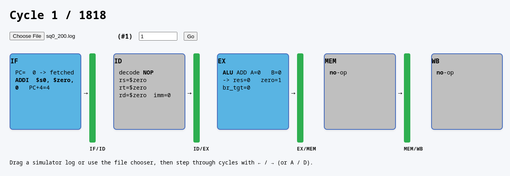

# MIPS-Pipeline Viewer

A lightweight, purely client-side web app that visualises a **5-stage MIPS pipeline** (IF → ID → EX → MEM → WB) cycle-by-cycle.


[https://mips-pipeline-viewer.netlify.app](https://mips-pipeline-viewer.netlify.app)



## ⌨️ Features

- Arrow key (left, right) support
- Jump to specific cycle
- Upload new log via file chooser or drag-and-drop onto the window

## 🚀 To Host Locally

Run in a terminal
```bash
git clone https://github.com/<you>/mips-pipeline-viewer.git
cd mips-pipeline-viewer

# optional: run a tiny local server
python -m http.server 8000
# then open http://localhost:8000/

```

## 📝 Log format

The viewer expects a **plain-text** log organised cycle-by-cycle, for example:

<pre>
================ Cycle 1 ================
 IF: PC=  0 -> fetched `ADDI  $s0, $zero, 0 `  PC+4=4
 ID: decode `NOP                 ` rs=$zero  rt=$zero  rd=$zero  imm=0   
 EX: ALU ADD A=0   B=0   -> res=0   zero=1 br_tgt=0
 MEM: no-op
 WB: no-op

================ Cycle 2 ================
 IF: PC=4   -> fetched `ADDI  $s1, $zero, 0 `  PC+4=8
 ID: decode `ADDI  $s0, $zero, 0 ` rs=$zero  rt=$s0    rd=$zero  imm=0   
 EX: ALU ADD A=0   B=0   -> res=0   zero=1 br_tgt=0
 MEM: no-op
 WB: no-op

================ Cycle 3 ================
 IF: PC=8   -> fetched `ADDI  $s2, $zero, 100`  PC+4=12
 ID: decode `ADDI  $s1, $zero, 0 ` rs=$zero  rt=$s1    rd=$zero  imm=0   
 EX: ALU ADD A=0   B=0   -> res=0   zero=1 br_tgt=4
 MEM: no-op
 WB: no-op

================ Cycle 4 ================
 IF: PC=12  -> fetched `ADDI  $t1, $zero, 201`  PC+4=16
 ID: decode `ADDI  $s2, $zero, 100` rs=$zero  rt=$s2    rd=$zero  imm=100 
 EX: ALU ADD A=0   B=100 -> res=0   zero=1 br_tgt=8
 MEM: no-op
 WB: write $s0    = 0
</pre>

### Rules

1. A cycle header line begins with at least two `=` characters and contains **`Cycle`** followed by its number.  
2. Each of the five stage lines starts with **`IF:` `ID:` `EX:` `MEM:` `WB:`** (exact spelling, case-sensitive).  
3. Everything after the first colon belongs to that stage and is shown **verbatim on one physical line**.  
4. Blank lines between cycles are allowed (and encouraged).  
5. Back-tick an instruction (`` `ADDI $s0,$zero,0` ``) to render its mnemonic **bold**.  
6. Stage colours are assigned by mnemonic class:

   | Bucket            | Colour | Mnemonics (examples)          |
   |-------------------|--------|-------------------------------|
   | Load / Store      | Green  | `LW`, `SW`, `LD`, `STORE …`   |
   | Branch / Jump     | Yellow | `BEQ`, `BNE`, `J`, `JR`       |
   | NOP / bubble      | Grey   | `NOP`, `NOOP`                 |
   | Arithmetic / misc | Blue   | Anything else                 |

> **Tip:** If your simulator emits multi-line details for a stage, join them with semicolons or compact whitespace – the viewer shows exactly what it receives.


